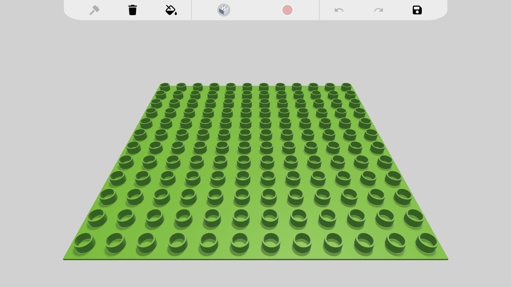
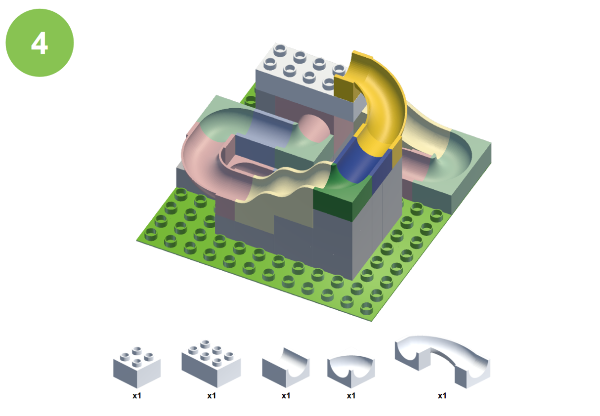

# Hubelino Editor

3D editor pro tvorbu a úpravu kuličkových drah Hubelino, vytvořený v Unity jako součást bakalářské práce.

Editor umožňuje navrhovat vlastní dráhy z jednotlivých stavebních bloků a následně je uložit nebo vygenerovat jako instrukce pro sestavení.

## Funkce

- Vytváření a úprava kuličkových drah Hubelino
- Výběr z několika typů bloků a jejich umisťování na desku nebo jiné bloky
- Systém automatického propojování bloků na vhodných místech
- Detekce neplatných drah, například bloků, které nejsou správně podepřené
- Generování instrukcí k sestavení dráhy ve formátu PDF
- Ukládání a načítání vytvořených drah
- Undo / Redo
- Obarvování bloků
- Intuitivní uživatelské rozhraní

## Použité technologie

- C#
- Unity
- PDF generování

## Náhled

## Ovládání

| Ovládání | Funkce |
|---|---|
| **Mouse 1** | Položení / odstranění / obarvení bloku |
| **Mouse 2** | Horizontální pohyb kamery |
| **Ctrl + Mouse 2** | Vertikální pohyb kamery |
| **Mouse 3** | Rotace kamery |
| **Ctrl + Mouse Scroll** | Přiblížení / oddálení kamery |
| **R** | Resetování kamery do původní polohy |
| **C** | Změna barvy bloku |
| **A / D** | Změna typu bloku |
| **Scroll Wheel / Z / X** | Rotace bloku |

## Vyzkoušení

Aktuální verzi editoru je možné stáhnout v sekci [Releases](../../releases).
